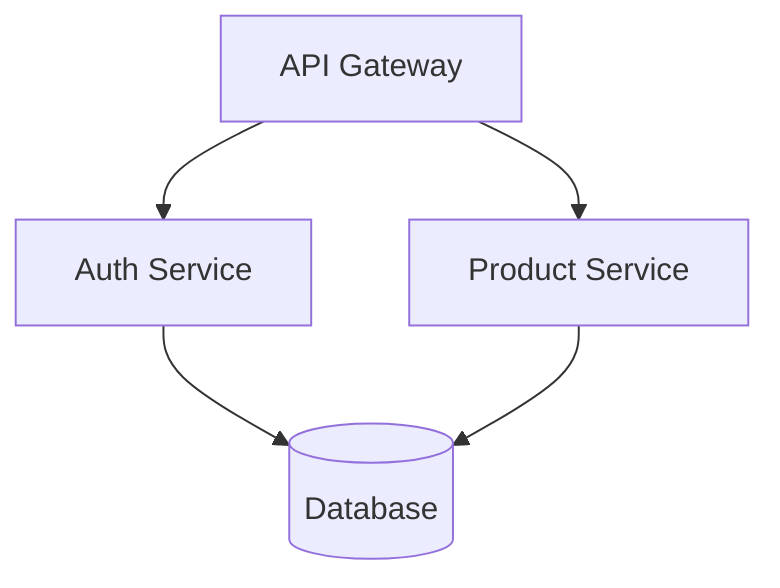

# Repo-Context Format Specification v1.0

## Introduction

### Purpose
The Repo-Context format provides a standardized, token-efficient way to represent code repository structure and content for consumption by both AI agents and human developers.

### Design Goals
- **Token efficiency**: Minimal markup overhead (<2% of total tokens)
- **Standardization**: Built on existing specifications (CommonMark, YAML 1.2)
- **Dual readability**: Native rendering for humans, structured parsing for AI
- **AI-friendly**: Designed for AI agents to both create and consume
- **Extensibility**: Support for metadata without breaking compatibility

### Conformance
A Repo-Context document MUST:
- Be valid CommonMark (as per https://spec.commonmark.org/)
- Include valid YAML 1.2 front matter
- Follow the structural requirements in this specification
- Use UTF-8 encoding

## Format Overview

A Repo-Context document consists of two parts:
1. **Front Matter**: YAML metadata block
2. **Content**: CommonMark formatted repository information

```markdown
---
[YAML front matter]
---

[CommonMark content]
```

## Front Matter Specification

### Structure
The front matter MUST:
- Begin with `---` on the first line
- End with `---` on its own line
- Contain valid YAML 1.2
- Include all required fields

### Required Fields

```yaml
version: "1.0"
repository:
  name: string
  total_lines: integer
  total_files: integer
  generated_at: string  # ISO 8601 datetime (UTC)
```

**Field Requirements:**

- **version**: String in format "major.minor" (e.g., "1.0")
- **repository.name**: Non-empty string, repository identifier
- **repository.total_lines**: Non-negative integer, sum of all code lines
- **repository.total_files**: Non-negative integer, count of all files included
- **repository.generated_at**: ISO 8601 datetime string in UTC (e.g., "2025-09-30T14:30:00Z")

### Optional Fields

```yaml
repository:
  description: string      # Brief description (1-2 sentences)
  primary_language: string # Dominant language
  languages: object        # Language breakdown as proportions
    python: float          # 0.0 to 1.0 (e.g., 0.75 = 75%)
    javascript: float
  entry_points: array      # Main entry files
    - string
  
files: array               # Per-file metadata
  - path: string           # Relative file path (no leading slash)
    lines: integer
    language: string
    description: string    # Brief file purpose (1 sentence)
    exports: array         # Public functions/classes (optional)
      - string
    imports: array         # Key dependencies (optional)
      - string

metadata:                  # Extensible metadata object
  [custom_key]: any        # Tool-specific extensions
```

**Optional Field Guidelines:**

- **repository.description**: Keep under 200 characters
- **repository.languages**: All values must sum to approximately 1.0
- **files**: Include only if detailed file metadata is useful
- **files[].path**: Use forward slashes, relative to repo root
- **files[].exports**: List only public/exported symbols
- **files[].imports**: List only significant dependencies
- **metadata**: Use for tool-specific data that doesn't fit elsewhere

### Example Front Matter

```yaml
---
version: "1.0"
repository:
  name: "ecommerce-api"
  description: "RESTful API for e-commerce platform with FastAPI and PostgreSQL"
  total_lines: 12340
  total_files: 47
  generated_at: "2025-09-30T14:30:00Z"
  primary_language: "python"
  languages:
    python: 0.80
    javascript: 0.15
    sql: 0.05
  entry_points:
    - "src/main.py"
    - "src/api/app.py"

files:
  - path: "src/main.py"
    lines: 450
    language: "python"
    description: "Application entry point and initialization"
    imports: ["api.app", "config", "logging"]
    exports: ["main", "initialize"]
  - path: "src/utils/helpers.py"
    lines: 120
    language: "python"
    description: "Utility functions for data processing"
    exports: ["format_date", "parse_json"]
---
```

## YAML Optimization for Token Efficiency

AI agents MUST apply these compression techniques to minimize token usage while maintaining clarity.

### Standard Abbreviations

Use consistent shorthand for common keys:

| Full Key | Abbreviation | Usage |
|----------|--------------|-------|
| dependencies | deps | Package/module dependencies |
| structure | struct | Directory structure |
| components | comp | UI/code components |
| properties | props | Component properties |
| description | desc | Descriptions |
| language | lang | Programming language |
| imports | imp | Import statements |
| exports | exp | Exported symbols |
| accessibility | a11y | Accessibility features |
| configuration | cfg | Configuration data |
| environment | env | Environment variables |

### YAML Anchors and Aliases

Use anchors (`&name`) and aliases (`*name`) for repeated values:

```yaml
# Define anchor for common language
files:
  - &py_lang {lang: python}
  
  # Reference with alias and merge
  - {p: "src/main.py", ln: 450, <<: *py_lang, desc: "Entry point"}
  - {p: "src/utils.py", ln: 120, <<: *py_lang, desc: "Utilities"}
```

**Common patterns:**
```yaml
# Language definitions
langs:
  py: &py {lang: python, ext: .py}
  js: &js {lang: javascript, ext: .js}
  ts: &ts {lang: typescript, ext: .ts}

# Reuse throughout
files:
  - {p: "main.py", <<: *py}
  - {p: "app.js", <<: *js}
```

### Compact Notation

**Arrays:** Use inline format for simple lists
```yaml
# Verbose (avoid)
imports:
  - api.app
  - config
  - logging

# Compact (prefer)
imp: [api.app, config, logging]
```

**Objects:** Use inline format for simple key-value pairs
```yaml
# Verbose (avoid)
metadata:
  lines: 450
  classes: 5
  functions: 12

# Compact (prefer)
meta: {ln: 450, cls: 5, fn: 12}
```

### Metadata Compression

Use `_:` pattern for directory-level aggregates:

```yaml
struct:
  src:
    _: {n: 120, t: {py: 40, js: 35, css: 45}}  # n=count, t=types
    api:
      _: {n: 25}
      files: [routes.py, auth.py, models.py]
    utils:
      _: {n: 15}
      files: [helpers.py, validators.py]
```

The `_:` key provides summary statistics without listing every file.

### Strategic Omissions

Omit null, empty, or default values:

```yaml
# Verbose (avoid)
files:
  - path: "main.py"
    lines: 450
    exports: []
    imports: null
    description: null

# Optimized (prefer)
files:
  - {p: "main.py", ln: 450}
```

### Complete Optimization Example

**Before (verbose - ~240 tokens):**
```yaml
repository:
  languages:
    python: 0.80
    javascript: 0.15
    sql: 0.05

files:
  - path: "src/main.py"
    lines: 450
    language: "python"
    description: "Application entry point"
    imports: ["api.app", "config", "logging"]
    exports: ["main", "initialize"]
  - path: "src/api/routes.py"
    lines: 680
    language: "python"
    description: "API endpoint definitions"
    imports: ["fastapi", "models", "auth"]
    exports: ["router", "health_check"]
  - path: "src/utils/helpers.py"
    lines: 120
    language: "python"
    description: "Utility functions"
    exports: ["format_date", "parse_json"]
```

**After (optimized - ~95 tokens, 60% reduction):**
```yaml
repository:
  langs: {py: 0.80, js: 0.15, sql: 0.05}

files:
  - &py {lang: python}
  - {p: "src/main.py", ln: 450, <<: *py, desc: "Entry point",
     imp: [api.app, config, logging], exp: [main, initialize]}
  - {p: "src/api/routes.py", ln: 680, <<: *py, desc: "API endpoints",
     imp: [fastapi, models, auth], exp: [router, health_check]}
  - {p: "src/utils/helpers.py", ln: 120, <<: *py,
     exp: [format_date, parse_json]}
```

### Optimization Guidelines for AI Agents

When generating YAML front matter:

1. **Define anchors first** for repeated patterns (language, common configs)
2. **Use abbreviations consistently** throughout the document
3. **Prefer inline notation** for arrays under 5 items and simple objects
4. **Omit empty values** unless they provide meaningful context
5. **Group related data** under single keys with nested structure
6. **Balance compression with readability** - don't sacrifice clarity for minimal gains
7. **Validate YAML syntax** after optimization to ensure anchors resolve correctly

### Token Budget Impact

Proper optimization can reduce front matter size by 40-60% while maintaining all essential information. For a typical repository context:

- **Unoptimized**: 2,000-3,000 tokens in front matter
- **Optimized**: 800-1,200 tokens in front matter
- **Savings**: 1,200-1,800 tokens available for code content

## Content Structure Specification

### Required Sections

The content MUST include the following sections in order:

#### Title (H1)
```markdown
# Repository Context: {repository.name}
```
- MUST be the first heading
- MUST match `repository.name` from front matter exactly
- MUST be the only H1 in the document

#### Overview (H2)
```markdown
## Overview
[Brief description of the repository purpose and architecture]
```
- MUST appear immediately after title
- SHOULD be 1-3 paragraphs
- SHOULD describe: purpose, architecture, key technologies
- MAY include Mermaid diagrams for architecture

#### Structure (H2)
```markdown
## Structure
```
[directory tree]
```
```
- MUST use fenced code block (triple backticks)
- MUST show directory hierarchy using indentation
- SHOULD include key directories and files
- MAY include file counts: `models/ [5 files]`
- SHOULD NOT exceed 50 lines
- MUST NOT use box-drawing characters (├──, │, └──, etc.)

**Example structure format:**

```
src/
  main.py
  api/
    app.py
    routes.py
  models/
    user.py
tests/
  test_api.py
README.md
```

#### File Sections (H2)
```markdown
## {file_path}

[Optional 1-sentence file description]

```{language}
[file contents]
```
```

**Requirements:**
- One H2 section per included file
- Heading MUST be the file path relative to repository root
- Code MUST be in fenced blocks with language identifier
- Language identifier SHOULD match common names: `python`, `javascript`, `typescript`, `java`, `go`, `rust`, etc.
- MAY include brief description (1 sentence) before code block
- Code block SHOULD preserve original formatting and indentation

### Optional Sections

These MAY appear between Structure and File sections:

#### Key Files
```markdown
## Key Files
- `src/main.py` - Application entry point [450 lines]
- `src/api/routes.py` - API endpoint definitions [680 lines]
- `tests/test_integration.py` - End-to-end test suite [340 lines]
```

Use when:
- Repository has many files but only some are critical
- Helpful to highlight entry points and main modules
- Line counts provide useful context

#### Dependencies
```markdown
## Dependencies

**Core:**
- FastAPI 0.104.0 - Web framework
- PostgreSQL 15 - Database
- Redis 7.0 - Caching layer

**Development:**
- pytest - Testing framework
- black - Code formatting
```

Use when:
- External dependencies are significant to understanding the code
- Version numbers are important
- Clarifies technology stack

#### Architecture
```markdown
## Architecture


```

Use when:
- System architecture is complex
- Visual representation aids understanding
- Multiple services or components interact

### Section Ordering

**Mandatory order:**
1. Front matter (YAML)
2. H1: Repository Context
3. H2: Overview
4. H2: Structure
5. [Optional H2 sections]
6. H2: File sections (one per file)

### Complete Example

```markdown
---
version: "1.0"
repository:
  name: "todo-api"
  description: "Simple REST API for managing todo items"
  total_lines: 580
  total_files: 4
  generated_at: "2025-09-30T15:45:00Z"
  primary_language: "python"
  entry_points:
    - "main.py"

files:
  - &py {lang: python}
  - {p: "main.py", ln: 120, <<: *py, desc: "FastAPI application and endpoints"}
  - {p: "models.py", ln: 85, <<: *py, desc: "Pydantic models"}
  - {p: "database.py", ln: 95, <<: *py, desc: "SQLite operations"}
  - {p: "tests/test_api.py", ln: 280, <<: *py, desc: "API tests"}
---

# Repository Context: todo-api

## Overview
A simple REST API for managing todo items, built with FastAPI and SQLite. 
Provides CRUD operations for todos with user authentication. Designed for 
educational purposes to demonstrate RESTful API design patterns.

## Structure
```
main.py
models.py
database.py
tests/
  test_api.py
requirements.txt
README.md
```

## Key Files
- `main.py` - FastAPI app with all endpoints [120 lines]
- `database.py` - Database operations and connection [95 lines]
- `tests/test_api.py` - Comprehensive API tests [280 lines]

## main.py

FastAPI application with CRUD endpoints for todo items.

```python
"""Todo API - Main application."""
from fastapi import FastAPI, HTTPException
from models import Todo, TodoCreate
from database import get_todos, create_todo, update_todo, delete_todo

app = FastAPI(title="Todo API")

@app.get("/todos")
async def list_todos():
    """Get all todos."""
    return {"todos": get_todos()}

@app.post("/todos")
async def add_todo(todo: TodoCreate):
    """Create a new todo."""
    new_todo = create_todo(todo)
    return {"todo": new_todo}

@app.put("/todos/{todo_id}")
async def modify_todo(todo_id: int, todo: TodoCreate):
    """Update an existing todo."""
    updated = update_todo(todo_id, todo)
    if not updated:
        raise HTTPException(status_code=404, detail="Todo not found")
    return {"todo": updated}

@app.delete("/todos/{todo_id}")
async def remove_todo(todo_id: int):
    """Delete a todo."""
    deleted = delete_todo(todo_id)
    if not deleted:
        raise HTTPException(status_code=404, detail="Todo not found")
    return {"message": "Todo deleted"}
```

## models.py

Pydantic models for request/response validation.

```python
"""Data models for todos."""
from pydantic import BaseModel
from typing import Optional

class TodoCreate(BaseModel):
    """Schema for creating a todo."""
    title: str
    description: Optional[str] = None
    completed: bool = False

class Todo(TodoCreate):
    """Schema for a todo with ID."""
    id: int
    
    class Config:
        from_attributes = True
```

## database.py

SQLite database operations for todo management.

```python
"""Database operations for todos."""
import sqlite3
from typing import List, Optional
from models import Todo, TodoCreate

DB_PATH = "todos.db"

def init_db():
    """Initialize database with todos table."""
    conn = sqlite3.connect(DB_PATH)
    conn.execute("""
        CREATE TABLE IF NOT EXISTS todos (
            id INTEGER PRIMARY KEY,
            title TEXT NOT NULL,
            description TEXT,
            completed BOOLEAN DEFAULT 0
        )
    """)
    conn.commit()
    conn.close()

def get_todos() -> List[Todo]:
    """Retrieve all todos."""
    conn = sqlite3.connect(DB_PATH)
    conn.row_factory = sqlite3.Row
    cursor = conn.execute("SELECT * FROM todos")
    todos = [Todo(**dict(row)) for row in cursor.fetchall()]
    conn.close()
    return todos

def create_todo(todo: TodoCreate) -> Todo:
    """Create a new todo."""
    conn = sqlite3.connect(DB_PATH)
    cursor = conn.execute(
        "INSERT INTO todos (title, description, completed) VALUES (?, ?, ?)",
        (todo.title, todo.description, todo.completed)
    )
    todo_id = cursor.lastrowid
    conn.commit()
    conn.close()
    return Todo(id=todo_id, **todo.dict())

def update_todo(todo_id: int, todo: TodoCreate) -> Optional[Todo]:
    """Update an existing todo."""
    conn = sqlite3.connect(DB_PATH)
    cursor = conn.execute(
        "UPDATE todos SET title=?, description=?, completed=? WHERE id=?",
        (todo.title, todo.description, todo.completed, todo_id)
    )
    conn.commit()
    updated = cursor.rowcount > 0
    conn.close()
    return Todo(id=todo_id, **todo.dict()) if updated else None

def delete_todo(todo_id: int) -> bool:
    """Delete a todo by ID."""
    conn = sqlite3.connect(DB_PATH)
    cursor = conn.execute("DELETE FROM todos WHERE id=?", (todo_id,))
    conn.commit()
    deleted = cursor.rowcount > 0
    conn.close()
    return deleted

# Initialize on import
init_db()
```

## tests/test_api.py

```python
"""API endpoint tests."""
import pytest
from fastapi.testclient import TestClient
from main import app

client = TestClient(app)

def test_create_todo():
    """Test creating a new todo."""
    response = client.post("/todos", json={
        "title": "Test todo",
        "description": "Test description"
    })
    assert response.status_code == 200
    data = response.json()
    assert data["todo"]["title"] == "Test todo"

def test_list_todos():
    """Test listing all todos."""
    response = client.get("/todos")
    assert response.status_code == 200
    assert "todos" in response.json()

def test_update_todo():
    """Test updating a todo."""
    # Create first
    create_response = client.post("/todos", json={"title": "Update me"})
    todo_id = create_response.json()["todo"]["id"]
    
    # Update
    response = client.put(f"/todos/{todo_id}", json={
        "title": "Updated title",
        "completed": True
    })
    assert response.status_code == 200
    assert response.json()["todo"]["completed"] is True

def test_delete_todo():
    """Test deleting a todo."""
    # Create first
    create_response = client.post("/todos", json={"title": "Delete me"})
    todo_id = create_response.json()["todo"]["id"]
    
    # Delete
    response = client.delete(f"/todos/{todo_id}")
    assert response.status_code == 200
    
    # Verify deleted
    get_response = client.put(f"/todos/{todo_id}", json={"title": "Gone"})
    assert get_response.status_code == 404
```
```

## Token Budget Guidelines

### Size Recommendations

AI agents creating context documents SHOULD follow these guidelines:

| Repository Size | Strategy | Target Token Count |
|----------------|----------|-------------------|
| < 5,000 lines | Include all files | < 50,000 tokens |
| 5,000 - 20,000 lines | Include entry points + key files | 50,000 - 150,000 tokens |
| 20,000 - 100,000 lines | Include summaries + selected files | 100,000 - 200,000 tokens |
| > 100,000 lines | Create index or split into multiple docs | Consider alternative approach |

### File Inclusion Strategy

When deciding which files to include, AI agents SHOULD prioritize:

1. **Entry points** (main.py, index.js, app.py)
2. **Core logic** (business logic, algorithms, main features)
3. **API definitions** (routes, endpoints, interfaces)
4. **Key models** (data structures, database models)
5. **Configuration** (if it reveals architecture)

AI agents SHOULD exclude or summarize:
- Test files (unless specifically requested)
- Generated files (build artifacts, compiled code)
- Vendor/dependency code
- Large data files
- Boilerplate code

### Content Optimization Techniques

**Full Inclusion** (files under 200 lines):
```markdown
## src/config.py
```python
[complete file contents]
```
```

**Partial Inclusion** (files 200-1000 lines):
```markdown
## src/large_module.py

Data processing module with validation, transformation, and export functions.

```python
def process_data(input_stream):
    """Processes incoming data streams.
    
    Args:
        input_stream: Raw data source
    Returns:
        Processed data dict
    """
    # ... implementation (450 lines total)
    pass

def validate_input(data):
    """Validates input data structure."""
    # ... implementation
    pass

# Additional 12 functions omitted for brevity
# Full file: 890 lines
```
```

**Summary Only** (files over 1000 lines):
```markdown
## src/orm_models.py

Database ORM models for all entities.

**Key Models:**
- User, Product, Order, Payment (core business entities)
- Session, Token, Cache (infrastructure models)
- 45 total classes, 120 methods

Lines: 2,340 | Classes: 45 | Methods: 120

Main entry points: `User.authenticate()`, `Order.create()`, `Payment.process()`
```

## AI Agent Guidance

### Creating Context Documents

When creating a Repo-Context document, AI agents SHOULD:

1. **Analyze repository structure first**
   - Identify primary language(s)
   - Locate entry points
   - Determine architecture (monolith, microservices, library, etc.)

2. **Generate accurate front matter**
   - Count total lines and files accurately
   - Calculate language proportions correctly
   - Use current UTC timestamp for `generated_at`
   - List actual entry point files
   - Apply YAML optimization techniques

3. **Write clear overview**
   - State the repository's purpose in 1-2 sentences
   - Mention key technologies and architecture pattern
   - Keep it under 200 words

4. **Create informative structure tree**
   - Show 2-3 levels of directory depth
   - Include key files at each level
   - Use consistent indentation (2 spaces per level recommended)
   - Do not use box-drawing characters

5. **Select files strategically**
   - Prioritize files that explain the system
   - Include diverse file types (models, routes, utils)
   - Balance breadth and depth

6. **Format code sections properly**
   - Preserve original indentation
   - Use correct language identifiers
   - Include brief context before code blocks
   - Ensure code blocks are properly closed

7. **Maintain consistency**
   - File paths in headings MUST match front matter
   - Language identifiers MUST match front matter
   - Repository name MUST be consistent throughout

### Quality Checklist

Before finalizing, AI agents SHOULD verify:

- YAML front matter is valid and complete
- All required sections are present and in order
- Repository name matches in H1 and front matter
- All code blocks have language identifiers
- All code blocks are properly closed (three backticks)
- File paths use forward slashes, no leading slash
- Line counts in front matter are accurate
- Total token count is reasonable for repository size
- Overview clearly explains purpose and architecture
- Structure tree is readable and informative
- YAML optimization techniques applied

### Common Mistakes to Avoid

**YAML Errors:**
```yaml
# ❌ Wrong - missing quotes on timestamp
generated_at: 2025-09-30T14:30:00Z

# ✅ Correct
generated_at: "2025-09-30T14:30:00Z"
```

```yaml
# ❌ Wrong - leading slash in path
- path: "/src/main.py"

# ✅ Correct  
- path: "src/main.py"
```

**Heading Errors:**
```markdown
❌ Wrong - multiple H1 headings
# Repository Context: myproject
# Another Heading

✅ Correct - only one H1
# Repository Context: myproject
## Another Heading
```

**Code Block Errors:**
```markdown
❌ Wrong - no language identifier
## main.py
```
def main():
    pass
```

✅ Correct
## main.py
```python
def main():
    pass
```
```

**Structure Errors:**
```markdown
❌ Wrong - uses box-drawing characters
## Structure
```
src/
├── main.py
└── api/
    └── app.py
```

✅ Correct - uses simple indentation
## Structure
```
src/
  main.py
  api/
    app.py
```
```

**Consistency Errors:**
```yaml
# Front matter says:
repository:
  name: "my-project"
```
```markdown
❌ Wrong heading:
# Repository Context: myproject

✅ Correct heading:
# Repository Context: my-project
```

## Extensibility

### Custom Metadata

AI agents MAY add custom fields under the `metadata` key for tool-specific information:

```yaml
metadata:
  generator: "claude-code-analyzer"
  analysis_depth: "full"
  git_commit: "a1b2c3d4"
  included_tests: false
  custom_tags: ["api", "production", "microservice"]
```

### Custom Sections

AI agents MAY add custom H2 sections after required sections but before file sections:

```markdown
## Test Coverage
Overall: 87% | Core modules: 92% | Utilities: 78%

## Recent Changes
- 2025-09-28: Added authentication middleware
- 2025-09-25: Refactored database layer
```

### Forward Compatibility

- Parsers MUST ignore unknown YAML fields
- Parsers MUST handle additional H2 sections gracefully
- New optional fields MAY be added in minor version updates
- Required fields MUST NOT change without major version bump

## Validation

### YAML Validation

The front matter MUST:
- Be valid YAML 1.2 syntax
- Include all required fields with correct types
- Use ISO 8601 format for timestamps
- Have language proportions that sum to ~1.0 (if present)

### Markdown Validation

The content MUST:
- Be valid CommonMark
- Contain exactly one H1 heading
- Include all required H2 sections (Overview, Structure)
- Use triple backticks for all code blocks
- Include language identifier for all code blocks

### Consistency Validation

Cross-document consistency:
- Repository name in H1 matches `repository.name` in YAML
- File count in content approximately matches `repository.total_files`
- If `files` array exists, paths should match H2 headings

## Version History

- **v1.0** (2025-09-30): Initial specification

## License

This specification is released under **CC0 1.0 Universal (Public Domain)**.

---

**Specification maintained as open standard for AI-generated repository context.**
